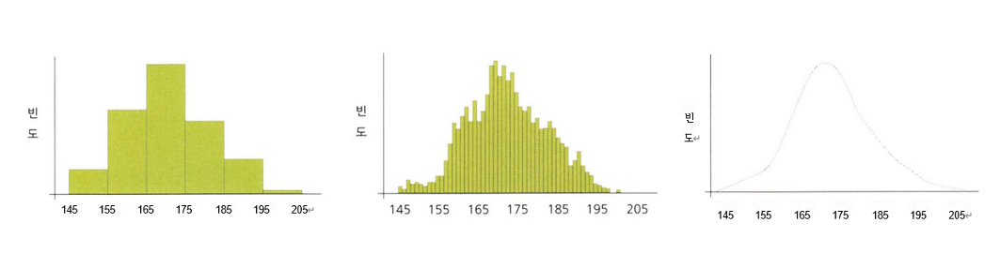

# 통계학 2주차 정규과제

📌통계학 정규과제는 매주 정해진 분량의 『*데이터 분석가가 반드시 알아야 할 모든 것*』 을 읽고 학습하는 것입니다. 이번 주는 아래의 **Statistics_2nd_TIL**에 나열된 분량을 읽고 `학습 목표`에 맞게 공부하시면 됩니다.

아래의 문제를 풀어보며 학습 내용을 점검하세요. 문제를 해결하는 과정에서 개념을 스스로 정리하고, 필요한 경우 추가자료와 교재를 다시 참고하여 보완하는 것이 좋습니다.

2주차는 `1부. 데이터 기초체력 기르기`를 읽고 새롭게 배운 내용을 정리해주시면 됩니다.


## Statistics_2nd_TIL

### 1부. 데이터 기초체력 기르기
### 06. 확률분포
### 07. 가설검정

## Study Schedule

|주차 | 공부 범위     | 완료 여부 |
|----|----------------|----------|
|1주차| 1부 p.2~56     | ✅      |
|2주차| 1부 p.57~79    | ✅      | 
|3주차| 2부 p.82~120   | 🍽️      | 
|4주차| 2부 p.121~202  | 🍽️      | 
|5주차| 2부 p.203~254  | 🍽️      | 
|6주차| 3부 p.300~356  | 🍽️      | 
|7주차| 3부 p.357~615  | 🍽️      |

<!-- 여기까진 그대로 둬 주세요-->

# 06. 확률분포

```
✅ 학습 목표 :
* 이산확률분포의 종류와 특징을 설명할 수 있다.
* 연속확률분포의 종류와 특징을 설명할 수 있다. 
* 중심극한정리(CLT)의 개념을 이해하고 설명 할 수 있다.
```

## 6.2. 이산확률분포

> **🧚 이산확률분포에 대해 학습한 내용을 정리해주세요.**

<!--수식과 공식을 암기하기보다는 분포의 개념과 특성을 위주로 공부해주세요. 분석 대상의 데이터가 어떠한 확률분포의 특성을 가지고 있는지를 아는 것이 더 중요합니다.-->

### 이산확률분포의 개념
> 이산확률 변수의 확률분포; 실수와 같이 명확한 값을 갖는 분포

### 이산확률분포의 종류
- 균등분포: X가 동일한 확률을 가지는 분포
- 이항분포: 1과 0의 값만을 갖는 분포
    - 베르누이 시행: 각각의 결과가 독립적으로 이루어져 이전의 나온 값이 다음 값에 영향을 주지 않는다. (1이 나올 확률 + 0이 나올 확률 = 1)
- 초기하분포: 비복원추출 방법으로 이항분포와 달리 각 시행이 서로 독립적이지 않다. 
    - 비복원추출: 표본에서 하나를 추출하고 다시 표본에 포함시키지 않음. 그래서 다음 결과에 이전의 값이 영향을 끼침
- 포아송분포: 일정한 시공간에서 특정 사건이 발생하는 횟수
    - 품질관리나 보험상품 개발등에 주로 사용됨
        - 예: 사람들이 특정 연령대 구간에 평균적으로 몇 번의 교통사고를 당하는지 통계적 확률값을 도출해내는 것.

    - 모든 사건을 독립적으로 발생하며, 시공간과 사건의 발생 비율은 항상 같다.
    - 한 번에 둘 이상의 사건은 발생하지 X
    
    ➡️ 성공과 실패, 즉 0과 1의 개념이 존재하지 않으며, 표본의 크기라는 개념또한 존재하지 않음


## 6.3. 연속확률분포

> **🧚 연속확률분포에 대해 학습한 내용을 정리해주세요.**

###연속 확률 분포의 개념
> 확률변수가 특정 구간에 속할 확률


히스토그램의 단위를 계속해서 세분화하다보면 세번째 그림과 같은 연속확률분포(확률밀도곡선)이 그려진다.

📈**확률밀도함수**
- 전체 분포에서 특정 구간인 a에서 특정 사건이 발생할 수 있는 확률을 구하기 위해 사용됨.

✔️이산확률분포: 특정 값을 가질 확률을 구하는것이 가능 → 확률 질량 함수를 통해 확률을 구함

✔️연속확률분포: 확률 밀도 함수를 통해 전체 분포 중 특정 면적을 적분을 통해 면적의 구간내에서 사건이 발생할 확률을 계산

### 정규분포
> 평균을 중심으로 좌우 대칭의 종 모양 형태를 띔

- 평균값 = 중앙값 = 최빈값
- 각기 다른 정규분포 간 비교의 동질성을 만들기 위해 `평균 = 0, 분산 = 1` 인 표준정규분포의 형태로 변환함

### 지수분포
> 특정시점~다음 사건이 일어나기까지의 대기시간을 다룸

- 표준정규분포처럼 절대적인 기준은 없고, 평균에 따라 기울기가 정해짐

## 6.4. 중심극한정리

> **🧚 중심극한정리에 대해 학습한 내용을 정리해주세요.**


# 07. 가설검정

```
✅ 학습 목표 :
* 귀무가설과 대립가설의 개념을 정의하고, 주어진 연구 질문에 적절한 가설을 설정할 수 있다.
* 가설검정의 유의수준과 p값의 개념을 설명하고, p값을 해석하여 귀무가설을 기각할지 여부를 판단할 수 있다.
* 1종 오류와 2종 오류의 차이를 설명하고, 실제 사례에서 어떤 오류를 더 중요하게 고려해야 하는지 판별할 수 있다.
```

<!-- 새롭게 배운 내용을 자유롭게 정리해주세요.-->


<br>
<br>

# 확인 문제

## 문제 1.

> **🧚Q. 다음 중 귀무가설(H₀)을 기각해야 하는 경우는 언제인가요? 정답을 고르고, 그 이유를 간단히 설명해주세요.**

> **1️⃣ 유의수준(α)이 0.05이고, p값이 0.03일 때   
2️⃣ 유의수준(α)이 0.01이고, p값이 0.02일 때**

```
여기에 답을 작성해주세요!
```

### 🎉 수고하셨습니다.