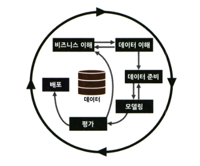
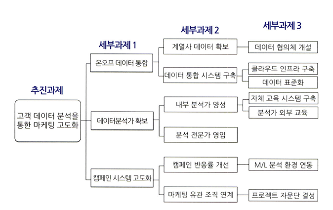
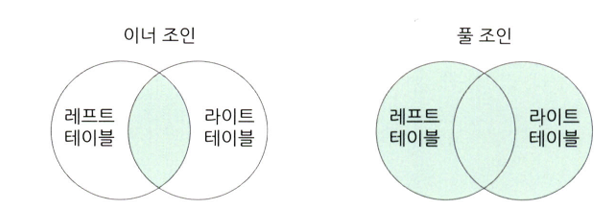
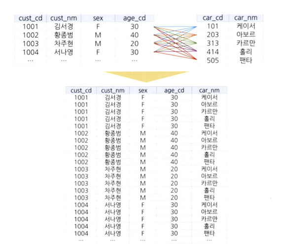
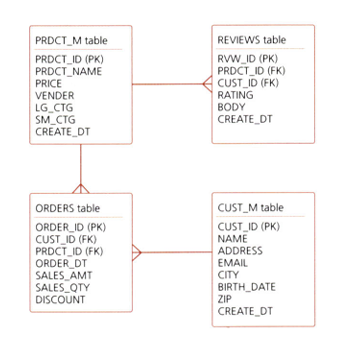

# 통계학 3주차 정규과제

📌통계학 정규과제는 매주 정해진 분량의 『*데이터 분석가가 반드시 알아야 할 모든 것*』 을 읽고 학습하는 것입니다. 이번 주는 아래의 **Statistics_3rd_TIL**에 나열된 분량을 읽고 `학습 목표`에 맞게 공부하시면 됩니다.

아래의 문제를 풀어보며 학습 내용을 점검하세요. 문제를 해결하는 과정에서 개념을 스스로 정리하고, 필요한 경우 추가자료와 교재를 다시 참고하여 보완하는 것이 좋습니다.

2주차는 `2부-데이터 분석 준비하기`를 읽고 새롭게 배운 내용을 정리해주시면 됩니다.


## Statistics_3rd_TIL

### 2부. 데이터 분석 준비하기
### 08. 분석 프로젝트 준비 및 기획
### 09. 분석 환경 세팅하기


## Study Schedule

|주차 | 공부 범위     | 완료 여부 |
|----|----------------|----------|
|1주차| 1부 p.2~56     | ✅      |
|2주차| 1부 p.57~79    | ✅      | 
|3주차| 2부 p.82~120   | ✅      | 
|4주차| 2부 p.121~202  | 🍽️      | 
|5주차| 2부 p.203~254  | 🍽️      | 
|6주차| 3부 p.300~356  | 🍽️      | 
|7주차| 3부 p.357~615  | 🍽️      |  

<!-- 여기까진 그대로 둬 주세요-->

# 08. 분석 프로젝트 준비 및 기획

```
✅ 학습 목표 :
* 데이터 분석 프로세스를 설명할 수 있다.
* 비즈니스 문제를 정의할 때 주의할 점을 설명할 수 있다.
* 외부 데이터를 수집하는 방법에 대해 인식한다.
```

## 데이터 분석의 3단계
```MARKDOWN
💡데이터분석의 궁극적인 목표 : 의사결정 프로세스를 최적화하는 것.
즉, 회사가 효과적인 결정을 할 수 있도록 도움을 주는 것 
```

### 1단계 - 설계단계
- 데이터 분석의 목표를 명확히 하고 프로젝트 수행 인력을 구성한다.

- 분석가와 실무자 간의 협업 및 의사소통이 중요하며, 정기적인 미팅을 통해 진행 상황을 공유하는 것이 좋다.

### 2단계 - 분석 및 모델링 단계
- 데이터 분석을 위한 환경 구축 및 본격적인 분석과 모델링을 수행한다.

- 데이터 추출, 검토, 가공, 모델링이 반복적으로 이루어지며, 모델의 성능과 비즈니스 적합성을 평가한다.

- 대표적 방법론으로 KDD, CRISP-DM, SEMMA 방법론이 있으며, 특히 CRISP-DM과 SEMMA가 자주 활용된다.

### 3단계 - 구축 및 활용 단계
- 최종 확정된 분석 모델을 실제 업무에 적용하고 성과를 평가한다.

- 실제 적용 시 예상치 못한 변수가 많아, 현업 부서 간 협업 및 IT 시스템 구축이 중요하다.

- 모델 적용 후 성과 측정 및 평가가 이루어지며, A/B 테스트 등을 통해 성과를 검증한다.

**💡CRISP-DM방법론**




1. 비즈니스 이해(Business understanding)
2. 데이터 이해(Data Understanding)
3. 데이터 준비(DATA PREPARATION)
4. 모델링(MODELLING)
5. 평가(EVALUATION)
6. 배포(DEPLOYMENT)


**💡SAS SEMMA 방법론**


1. 초반부
- 비즈니스 문제와 해결 방향을 정의하고, 데이터 탐색

2. 중반부
- 데이터를 목적에 맞도록 수집 및 가공하고, 필요에 따라 머신러닝 모델을 사용

3. 후반부
- 데이터 분석 결과를 검토 및 검증 후, 실제 환경에 적용
- 지속적으로 효과 및 성과를 모니터링하면서 보완하는 단계가 수반되어야 함. 

---

## 비즈니스 문제 정의시 주의할 점

### 데이터 분야에서의 채찍효과과


공급사슬에서의 채찍효과처럼 데이터 분석 프로젝트에서도 채찍효과가 발생할 수 있다.

비즈니스 이해 및 문제 정의가 잘못되면, 최종 인사이트 도출 및 적용단계에서 제대로 된 효과를 보기 힘들기 때문이다.

후반부에와서 프로젝트의 목적이 불분명해진다는 것이 정~말 공감됐다

### MECE
> Mutually Exclusive Collectively Exhaustive의 약자로, 세부 정의들이 서로 겹치지 않고, 전체를 합쳤을 때는 빠진 것 없이 완전히 전체를 이루는 것



---

## 외부 데이터 수집 방법


### 1. 데이터 구매 / 공유
전문 기업을 통해 데이터를 구매하거나 MOU를 통해 공유하는 방법
- 장점: 정제된 고품질의 데이터를 획득할 수 있다
- 단점: 비용이 비싸거나, 절차가 복잡할 수도 있다

### 2. 공공 데이터 포털 활용
- 장점: 무료이고, CSV, EXCEL, API등의 형태로 쉽게 다운받을 수 있다.
- 단점: 활용성이 높은 데이터를 찾기 어려울 수 있다.

### 3. 웹크롤링
HTML구조를 활용해서 웹사이트에서 필요한 데이터를 자동으로 반복적으로 수집하는 방법이다.
- 장점: 데이터를 실시간으로 자유롭게 수집할 수 있음
- 단점: 데이터 수집을 위한 프로그래밍이 필요하고, 웹페이지가 리뉴얼되면, 수집코드도 이에 맞춰 수정되어야함.

---

# 09. 분석 환경 세팅하기

```
✅ 학습 목표 :
* 데이터 분석의 전체적인 프로세스를 설명할 수 있다.
* 테이블 조인의 개념과 종류를 이해하고, 각 조인 방식의 차이를 구분하여 설명할 수 있다.
* ERD의 개념과 역할을 이해하고, 기본 구성 요소와 관계 유형을 설명할 수 있다.
```

## 데이터 분석의 전체적인 프로세스

```MARKDOWN
💡 OLTP → DW(ODS) → DM → OLAP

제품이 생산되고 → 창고에 저장했다가 → 소매점으로 이동 → 소비자에게 전달
```

### OLTP(On-Line Transaction Processing)
실시간으로 **데이터를 수집, 분류, 저장**하는 시스템

예시) 은행에서 기록을 오류없이 실시간으로 처리하고 저장하는 시스템

### DW(Data Warehouse)
수집된 데이터를 사용자 관점에서 주제별로 통합해 쉽게 원하는 데이터를 빼낼 수 있도록 저장해놓은 창고같은 개념의 통합 데이터베이스

➕ **ODS (Operational Data Store)**

DW 저장 전, <U>임시로 최신 데이터를 저장하는 공간</U>


### DM(Data Mart)
사용자의 목적에 맞도록 가공된 일부의 데이터가 저장되는 곳

예시) 기업의 경우, 부서마다 필요한 데이터가 서로 다를때, 사용자 집단의 필요에 맞도록 가공된 개별 데이터의 저장소

### ETL
> Extract, Transform, Load의 준말

- Extract
    - 원천 소스 DB로부터 필요한 데이터를 읽어 들이는 과정

- Transform
    - RAW 데이터를 정리, 필터링, 정형화하고 요약해 분석에 적합한 상태로 바꿔놓는 과정정

- Load의
    - 변환된 데이터를 새로운 테이블에 적재하는 과정


전통적으로 DW환경에서 저장된 데이터를 사용자가 요구하는 포맷으로 변형해서 이동시키는 작업과정을 의미한다.

---

## 테이블 조인의 이해

### 조인의 개념과 종류

**JOIN**
: 두 개 이상의 테이블을 <U>**공통된 컬럼을 기준으로**</U> 결합하는 것
- 여러 테이블에서 정보가 필요할 때, 한 번에 조회하기 위해서 사용된다.

### 조인 방식의 차이


#### LEFT JOIN
왼쪽 테이블의 모든 행을 출력하고, 오른쪽 테이블에 매칭되는 값이 있으면 결합 / 없으면 NULL값이 채워짐

#### RIGHT JOIN
오른쪽 테이블의 모든 행을 출력하고, 왼쪽 테이블에 매칭되는 값이 있으면 결합 / 없으면 NULL값이 채워짐

(LEFT JOIN이 권장됨)



#### INNER JOIN(교집합)
두 테이블의 공통컬럼 모두 존재하는 행만 결합

#### FULL JOIN(합집합)
양쪽 테이블의 모든행을 포함하고, 매칭되지 않으면 NULL로 채운다



#### CROSS JOIN
두 테이블의 모든 행을 조합
- 조인 조건 없이 가능한 모든 조합을 생성함

- EX: 상품 X 고객 = 가능성이 있는 모든 구매 리스트가 출력됨

---

## ERD의 이해
### ERD의 개념과 역할

**ERD(Entity Relationship Diagram)**



각 테이블의 구성정보와 테이블 간의 관계를 도식화해서 표현환 그림

- 물리적 ERD
    - DB를 실제로 구축하기 위한 기술적, 효율적 설게
    - 컬럼의 타입, 길이, 제약조건 등이 자세하게 명시된다

- 논리적 ERD
    - 사용자 입장에서 테이블과의 관계를 정확히 이해할 수 있도록 구성됨
    - 데이터의 정규화를 확인하는 목적으로 사용됨 


### ERD의 기본 구성 요소

엔티티 간의 연결 구조는 **기본 키와 외래 키**를 통해 표현된다.

- 기본 키
    - 엔티티 내 데이터를 유일하게 구별하는 컬럼
    - 중복,결측값 x
- 외래 키
    - 다른 테이블과 연결하기 위한 컬럼
    - 중복, 결측값 O
    - 외래 키가 정의된 테이블 = 자식테이블,
    - 외래키가 참조되는 테이블 = 부모테이블

### ERD의 관계 유형


- 1:1 관계 유형


<br>
<br>

# 확인 문제

## 문제 1.

> **🧚 아래의 테이블을 조인한 결과를 출력하였습니다. 어떤 조인 방식을 사용했는지 맞춰보세요.**

> 사용한 테이블은 다음과 같습니다.

|
---|---|

> 보기: INNER, LEFT, RIGHT 조인

<!-- 테이블 조인의 종류를 이해하였는지 확인하기 위한 문제입니다. 각 테이블이 어떤 조인 방식을 이용하였을지 고민해보고 각 테이블 아래에 답을 작성해주세요.-->

### 1-1. 

```
LEFT JOIN

: 이름이 포함된(왼쪽 테이블이라고 칭하겠음) 테이블에 dep_cd = NULL인 조용호 사장의 행이 있는데, 이 행도 결과에 포함되어있다.

 왼쪽 테이블의 모든 행을 유지하면서, dep_cd에 맞는는 오른쪽 테이블 값이 매칭되고 오른쪽 테이블에 없는 값은 비어었기 때문에 LEFT JOIN인 것을 알았다.
```

### 1-2. 

```
INNER JOIN

:dep_cd=NULL값이었던 조용호 사장의 행이 사라지고, 왼쪽 테이블과 오른쪽 테이블에 dep_cd의 값이 공통적으로 있는 행만 매칭되었기 때문문
```

### 1-3. 

```
RIGHT JOIN

: 문제 1-1과 반대로 오른쪽 테이블의 모든 행이 출력되고, 오른쪽 테이블과 dep_cd가 동일하지 않은 값은 NULL로 출력되고 있기 때문이다.
```

### 🎉 수고하셨습니다.