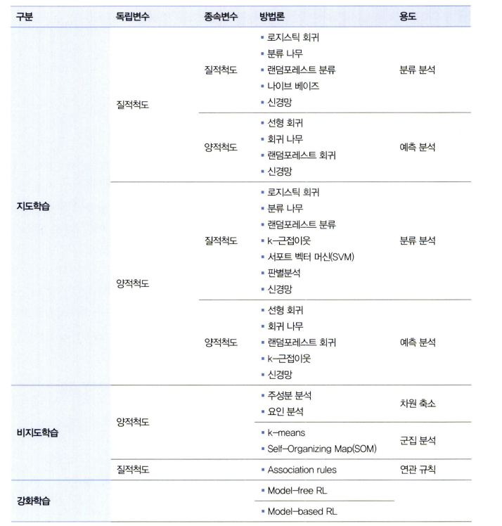
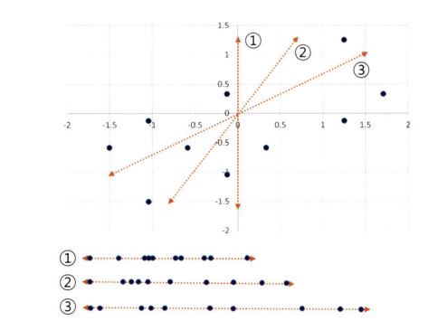
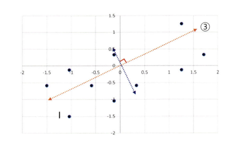

# 통계학 6주차 정규과제

📌통계학 정규과제는 매주 정해진 분량의 『*데이터 분석가가 반드시 알아야 할 모든 것*』 을 읽고 학습하는 것입니다. 이번 주는 아래의 Statistics_6th_TIL에 나열된 분량을 읽고 `학습 목표`에 맞게 공부하시면 됩니다.

아래의 문제를 풀어보며 학습 내용을 점검하세요. 문제를 해결하는 과정에서 개념을 스스로 정리하고, 필요한 경우 추가자료와 교재를 다시 참고하여 보완하는 것이 좋습니다.

6주차는 `3부. 데이터 분석하기`를 읽고 새롭게 배운 내용을 정리해주시면 됩니다.


## Statistics_6th_TIL

### 3부. 데이터 분석하기
### 12.통계 기반 분석 방법론


## Study Schedule

|주차 | 공부 범위     | 완료 여부 |
|----|----------------|----------|
|1주차| 1부 p.2~56     | ✅      |
|2주차| 1부 p.57~79    | ✅      | 
|3주차| 2부 p.82~120   | ✅      | 
|4주차| 2부 p.121~202  | ✅      | 
|5주차| 2부 p.203~254  | ✅      | 
|6주차| 3부 p.300~356  | ✅      | 
|7주차| 3부 p.357~615  | 🍽️      |

<!-- 여기까진 그대로 둬 주세요-->

# 12.통계 기반 분석 방법론

```
✅ 학습 목표 :
* 주성분 분석(PCA)의 개념을 설명할 수 있다.
* 다중공선성을 진단할 수 있다.
* Z-TEST와 T-TEST의 개념을 비교하고, 적절한 상황에서 검정을 설계하고 수행할 수 있다.
* ANOVA TEST를 활용하여 세 개 이상의 그룹 간 평균 차이를 검정하고, 사후검정을 수행할 수 있다.
* 카이제곱 검정을 통해 범주형 변수 간의 독립성과 연관성을 분석하는 방법을 설명할 수 있다.
```

## 12.1. 분석 모델 개요




### 🌟통계모델과 기계학습

| 항목 | 통계 모델 (Statistical Models) | 기계 학습 (Machine Learning) |
| -- | -------------------------- | ------------------------ |
| 목적 | 해석 중심: 변수 간 관계 설명      | 예측 중심: 정답 예측 정확도 향상  |
| 기반 | 통계 이론, 가정 기반               | 데이터 기반, 경험적 학습           |
| 특징 | 오차/불확실성 강조             | 정확도/성능 강조            |
| 응용 | 가설 검정, 분산 분석 등             | 분류, 회귀, 추천, 군집 등         |

### 🌟 통계모델 분석 방법론 정리 🌟

| 독립변수 | 종속변수 | 분석 기법          | 주요 용도             |
| ---- | ---- | -------------- | ----------------- |
| 질적   | 질적   | 교차분석, 스피어만 상관  | 연관성 분석            |
| 질적   | 양적   | Z-test, T-test | 가설 검정         |
| 질적   | 양적   | ANOVA, MANOVA  | 집단 간 평균 차이 분석 |
| 양적   | 양적   | 피어슨 상관분석       | 연관성 분석            |

### 기계 학습 유형별 정리

#### 1. 지도학습
- 라벨이 있는 데이터
- 대표 모델:
    - 결괏값: **양적 척도 → 회귀방식**의 방법론 사용
    - 결괏값: **질적 척도 → 분류 방식**의 방법론 사용

**🔎양적 종속변수와 질적 종속변수**
- 양적 종속변수
    - 연속적이거나 이산적인 수치
    - 수치간의 크기 비교 가능
    - 예시: 키, 몸무게, 가격
    
    ➡️ 회귀모델 사용(ex:선형회귀, 회귀트리, 랜포회귀)

- 질적 종속변수 
    - 정해진 '범주' 또는 '이름'으로 구분되는 값
    - 크기 비교 불가
    - 예시: 합격여부, 고객 등급, 종류

    ➡️ 분류모델 사용(분류트리, 나이브베이즈, 랜포 분류)

#### 2. 비지도 학습
- 정답 없이 패턴 찾기
- 용도: 군집분석(고객 세분화), 차원축소, 연관규칙(장바구니 분석)
- 대표 모델:
    - 군집: K-means
    - 차원축소: PCA, 요인분석
    - 규칙: Associatoin Rules
#### 3. 강화학습
- 보상을 기반으로 시행착오를 통해 학습
- 용도: 복잡한 행동 시나리오 학습
- 예시: 원숭이의 바나나, 전기 버튼 실험


## 12.2. 주성분 분석(PCA)
### 차원축소가 필요한 이유
✔️차원의 저주 방지
```TYPESCRIPT
🔎차원의 저주란?

변수가 늘어남에 따라 차원(=데이터셋의 변수, 공간상의 점의 위치를 나타내기 위해 필요한 축의 개수)이 커지면서, 
예측이 불안정해지는 문제

EX: 과적합 위험성의 증가 OR 다중공선성 문제
```

✔️ 데이터 시각화 / 노이즈 제거 / 성능 제거

✔️ 변수 간 상관관계 반영 후 중복을 제거할 수 있어서.

### 차원 축소 방법 2가지
1. 변수 선택 방식
: 불필요하거나 유사한 변수를 **제거** 
    - 변수 제거
    - 상관관계 기반 선택

2. 변수 추출 방식
: 기존 변수들로부터 **새로운 변수**생성

    - PCA등 요인 분석

### PCA란?
>여러 개의 변수를 하나의 핵심 축(=주성분)으로 요약해서 차원을 줄이는 기법

### PCA의 작동조건🌟
- 모든 변수는 연속형 변수여야한다.
- 변수들은 표준화가 되어있어야 한다.
- 변수 간 상관관계가 있어야 PCA를 하는 것에 의미가 있다

### PCA의 작동순서 및 원리 정리🌟

#### STEP 1. 데이터 표준화
- 변수 표준화하기(평균:0, 분산:1)
- 스케일이 큰 변수가 영향을 너무 크게 미치지 않게 하려는 과정

#### STEP 2. 분산이 가장 큰 축,즉 주성분 찾기
- PCA는 '가장 퍼진 방향'을 찾는다

- 제 1 주성분: **각 점을 원점에서 직각으로 내렸을 때, <U>그 선을 따라서 가장 멀리 퍼져 있는 축</U> **

    

    ✅ 주성분:3번

#### STEP 3: 그 다음 주성분은?
- 첫 번째 주성분과 직각이면서 그 다음으로 분산이 큰 축


    

    📝 **최대 생성 가능한 주성분 수 = 원래 변수 개수**

#### ➕ PCA의 축 설정방법


점들과 주성분 간의 직각 거리 제곱합이 최소가 되도록 축을 설정함.

➡️ 정보 손실은 최소로 하면서, 변수를 줄이는 요약 기술

#### 각 주성분의 설명력: 분산 비율로 계산한다.

EX:
- 총 분산이 20
- PC1 분산이 15 → 설명력 75%(20 중 15 → 75%)
- PC2 분산이 5 
→ 설명력 25% (PC1가 차지한 것의 나머지 = 25%)

---

## 12.4. 다중공선성 해결과 섀플리 밸류 분석

## 다중 공선성성
### 🔎다중공선성이란?
둘 이상의 독립변수들이 서로 높은 상관관계를 가질 때 생기는 문제

- 회귀계수의 해석이 어려워짐
- 예측 정확도가 낮아져 모델의 신뢰도가 낮아짐
- 어떤 변수가 영향을 주는지 구분을 쉽게 할 수 없음

**예시**
교통사고 발생률(y) ~ 마신 술의 양 + 혈중알콜농도(X)

- 마신 술의 양과 혈중 알콜농도는 매우 높은 상관관계가 있음

    ➡️비슷한 정보를 2번 넣은 셈, 모델 학습 성능 저하 요인

### 다중공선성 판단 기준
1. 상관계수: 두 변수 간 상관계수
- 절대치가 0.7 이상이면 두 변수 간의 상관성이 높다는 것
    
    ➡️ 다중 공선성이 나타날 것을 의심할 수 있음

    ⚠️ 하지만 변수가 많을 경우 상관성이 파악하기 힘듦

2. t값: 회귀계수의 유의성
- 독립변수들의 설명력을 의미하는 **<U>결정계수 값은 크지만, 회귀계수에 대한 T-VALUE가 낮다**</U>면 다중공선성을 의심해볼 수 있음!! 

    | t값 절대값  | 유의수준 (α) |
    | ------- | -------- |
    | ≥ 2.58  | 0.01     |
    | ≥ 1.96  | 0.05     |
    | ≥ 1.645 | 0.10     |

    ➡️ t값이 작다 = 설명력이 약하거나 공선성이 크다

3. VIF: 분산 팽창 계수
- 회귀분석 모델에 사용된 변수가 다른 변수들에 의해 설명될 수 있는 정도

    ➡️ 즉, VIF가 크다는 것은 해당 변수가 다른 변수들과의 상관성이 높다는 것

    - VIF[1 ~ ∞]
        - VIF ≥ 5: 다중 공선성 의심
        - VIF ≥ 10: 다중공선성이 있다고 판단.

### 다중공선성 해결 방법
- VIF가 큰 변수 제거
    - VIF값이 높은 변수들 중 종속변수와의 상관성이 가장 낮은 변수 제거 후 VIF 확인하는 과정 반복
    - 변수 제거 과정에서 도메인 지식 고려 필요!
- 변수 변환
    - 로그, 표준화 및 정규화 변환
- 변수 축약
    - PCA 활용
- 변수 선택 알고리즘
    - 전진 선택법
    - 후진 제거법
    - 단계적 선택법
- 변수 가공
    
## Shapley Value
각 독립변수가 종속변수에 기여하는 정도를 공정하게 수치로 계산

**계산방법 예시:**

x1, x2, x3 세개의 변수가 있을 때, 이들이 설명력에 각각 얼마나 기여했는지를 분배

- x1, x2 조합의 설명력: 0.32
- x2 혼자 0.21의 설명력 → x1의 기여 = 0.11


## 12.6. Z-test와 T-test
### 🌟Z-test와 T-test의 기본 개념
| 구분    | Z-test                                     | T-test                             |
| ----- | ------------------------------------------ | ---------------------------------- |
| 사용 조건 | 모집단의 분산(σ²)을 **알고 있을 때**                   | 모집단 분산을 **모를 때**, 표본에서 추정          |
| 표본 크기 | **n ≥ 30** (대표본)                           | **n < 30** (소표본) → 하지만 일반적으로 널리 사용 |
| 분석 대상 | 평균 or 비율 차이                                | 평균 or 비율 차이                        |
| 예시    | 전국 쇼핑몰 평균 매출 67만 vs 특정 지역 68.5만 → 모집단 정보 O | 마케팅 적용 전/후 고객 매출 변화 (표본만 존재)       |

### 🌟검정 목적에 따른 선택
| 비교 대상          | 검정 종류           | 사용 예                |
| -------------- | --------------- | ------------------- |
| 한 집단 평균 vs 기준값 | 단일 평균 검정        | 우리반 평균 성적 vs 전국 평균  |
| 두 집단 평균 비교     | **독립표본 T-test** | 마케팅 전/후 평균 매출 비교    |
| 두 집단 비율 비교     | **비율 T-test**   | A/B 테스트에서 구매율 차이    |
| 세 집단 이상 평균 비교  | **ANOVA**       | 지점 A/B/C의 고객 만족도 비교 |

### 유의확률과 양측/단측 검정
- 유의수준 α = 0.05 (일반적 기준)
- 양측 검정: 차이만 보는 경우 (기준값과 다르다)
- 단측 검정: 값이 크거나 작다를 명시할 때

## 12.7. ANOVA
<!-- 새롭게 배운 내용을 자유롭게 정리해주세요.-->

## 12.8. 카이제곱 검정(교차분석)
<!-- 새롭게 배운 내용을 자유롭게 정리해주세요.-->


<br>
<br>

# 확인 문제

### 문제 1.
> 🧚 경희는 다트비 교육 연구소의 연구원이다. 경희는 이번에 새롭게 개발한 교육 프로그램이 기존 프로그램보다 학습 성취도 향상에 효과적인지 검증하고자 100명의 학생을 무작위로 두 그룹으로 나누어 한 그룹(A)은 새로운 교육 프로그램을, 다른 그룹(B)은 기존 교육 프로그램을 수강하도록 하였다. 실험을 시작하기 전, 두 그룹(A, B)의 초기 시험 점수 평균을 비교한 결과, 유의미한 차이가 없었다. 8주 후, 학생들의 최종 시험 점수를 수집하여 두 그룹 간 평균 점수를 비교하려고 한다.   

> 🔍 Q1. 이 실험에서 사용할 적절한 검정 방법은 무엇인가요?

```
여기에 답을 작성해주세요!
```

> 🔍 Q2. 이 실험에서 설정해야 할 귀무가설과 대립가설을 각각 작성하세요.

```
여기에 답을 작성해주세요!
```

> 🔍 Q3. 검정을 수행하기 위한 절차를 순서대로 서술하세요.

<!--P.337의 실습 코드 흐름을 확인하여 데이터를 불러온 후부터 어떤 절차로 검정을 수행해야 하는지 고민해보세요.-->

```
여기에 답을 작성해주세요!
```

> 🔍 Q4. 이 검정을 수행할 때 가정해야 하는 통계적 조건을 설명하세요.

```
여기에 답을 작성해주세요!
```

> 🔍 Q5. 추가적으로 최신 AI 기반 교육 프로그램(C)도 도입하여 기존 프로그램(B) 및 새로운 프로그램(A)과 비교하여 성취도 차이가 있는지 평가하고자 한다면 어떤 검정 방법을 사용해야 하나요? 단, 실험을 시작하기 전, C 그룹의 초기 점수 평균도 A, B 그룹과 유의미한 차이가 없었다고 가정한다.

```
여기에 답을 작성해주세요!
```

> 🔍 Q6. 5번에서 답한 검정을 수행한 결과, 유의미한 차이가 나타났다면 추가적으로 어떤 검정을 수행해 볼 수 있을까요?

```
여기에 답을 작성해주세요!
```

---

### 문제 2. 카이제곱 검정  
> 🧚 다음 중 어떠한 경우에 카이제곱 검정을 사용해야 하나요?   
1️⃣ 제품 A, B, C의 평균 매출 차이를 비교하고자 한다.  
2️⃣ 남성과 여성의 신체 건강 점수 평균 차이를 분석한다.  
3️⃣ 제품 구매 여부(구매/미구매)와 고객의 연령대(10대, 20대, 30대…) 간의 연관성을 분석한다.  
4️⃣ 특정 치료법이 환자의 혈압을 감소시키는 효과가 있는지 확인한다.  

```
여기에 답을 작성해주세요!
```

### 🎉 수고하셨습니다.